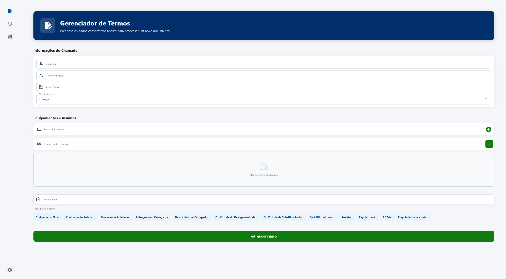
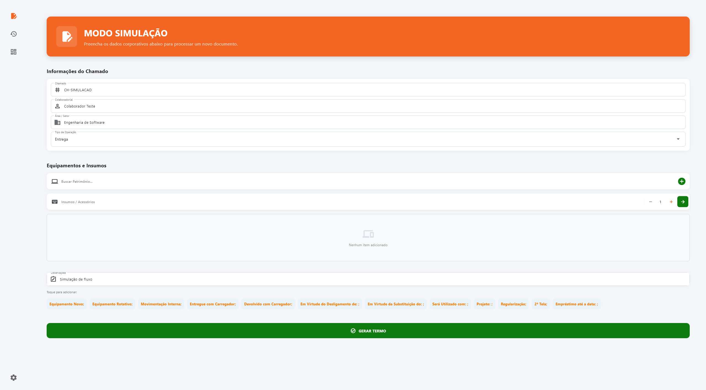
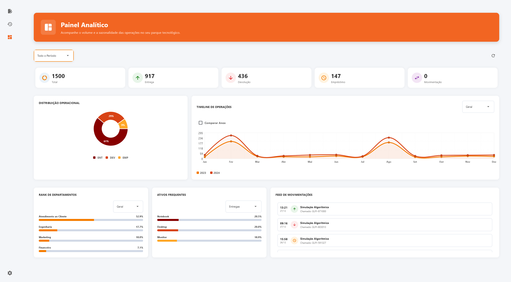

# GDT - Gerenciador de Termos

> Case Real de Transformação Digital: Este projeto foi desenvolvido para resolver um problema real de um Núcleo de Tecnologia da Informação (NTI), transformando um processo operacional analógico em um produto de dados de ponta a ponta.

> Nota de Privacidade (LGPD): Todos os dados, nomes de colaboradores, chamados e patrimônios apresentados neste painel e ao longo deste repositório são 100% fictícios e gerados algoritmicamente via Mock Engine para fins de demonstração, garantindo total conformidade com a Lei Geral de Proteção de Dados.

## Problema de Negócio
O departamento de TI (NTI) enfrentava um colapso de governança de dados impulsionado por um processo operacional obsoleto: a criação manual de Termos de Responsabilidade para entrega e devolução de equipamentos. 

Esta operação manual gerou duas grandes dores para o setor:
1. O Déficit do Legado: Anos de histórico de movimentação de hardware estavam presos em milhares de arquivos Word e PDF ilegíveis para sistemas de análise.
2. A Geração de Lixo de Dados: A falta de padronização na entrada de dados no dia a dia criava ativos órfãos e multiplicava cadastros sujos (ex: Dell, DELL INC, Del), cegando a gestão sobre o ciclo de vida e volume real do inventário.

## Objetivo do Projeto
Construir uma plataforma orientada a dados (Data-Driven) que resolve o problema em duas frentes:
1. Estancar a sangria de dados na origem: Criar um Gerador de Termos Automatizado que força a inserção estruturada de dados no momento da operação de TI.
2. Resgatar o passado: Utilizar Inteligência Artificial (LLMs) para atuar como um pipeline de extração (ETL), convertendo os milhares de documentos não estruturados antigos em um banco de dados relacional governado, culminando em um Dashboard Analítico em tempo real.

## Estratégia da Solução e Arquitetura de Dados
A arquitetura foi desenhada fundindo Engenharia de Software (MVC) com a Medallion Architecture (Bronze, Silver, Gold):

1. Ingestão em Tempo Real (O Gerador de Termos): Através de um motor Jinja2 + Automação COM (Windows), o sistema gera os PDFs legais ao mesmo tempo que injeta, de forma atômica e padronizada, os Fatos e Dimensões diretamente na Camada Gold, garantindo Governança de Dados na Origem.
2. Bronze Layer (Ingestão do Legado): Pipeline assíncrono de varredura OCR para captura do texto bruto de arquivos antigos (.docx, .pdf).
3. Silver Layer (AI Processing & Data Quality): A API do Google Gemini atua como um Agente de Extração de Entidades Nomeadas (NER). A sua saída é interceptada por um middleware de Lógica Nebulosa (Fuzzy Matching) em Python, que normaliza strings erráticas e barra alucinações da IA antes da persistência.
4. Gold Layer (Modelagem e MDM): Persistência em um banco SQLite otimizado (PRAGMA, Índices B-Tree) focado em consultas OLAP. Um módulo de MDM (Master Data Management) permite auditoria, eliminação de duplicatas e reindexação da base de dados.
5. Visualization Layer (BI): Cockpit Analítico robusto com reatividade assíncrona para plotagem de Séries Temporais e Distribuições de Carga.

## Tecnologias Utilizadas
- Engenharia de Dados: Arquitetura ETL/ELT, Limpeza de Dados (Fuzzy String Matching via difflib), Processamento em Lote (Batch), Master Data Management (MDM).
- Análise e Visualização de Dados (BI): Construção de Cockpit Analítico, modelagem de Séries Temporais para detecção de sazonalidade, cálculo de KPIs operacionais e Data Storytelling.
- Inteligência Artificial: Google Generative AI (Gemini Pro) com Engenharia de Prompt restritiva (JSON Schema Forcing).
- Banco de Dados: SQLite3 (Transações ACID, Foreign Keys, PRAGMA Tuning para OLAP).
- Automação e Parsing: Motor Jinja2 (docxtpl), Integração COM/Win32 para automação e geração de documentos físicos.
- UI/UX e Software Design: Python 3.10+, Flet (Flutter para Python), MVC, SOLID, Design Patterns (Observer, Strategy).

## Principais Insights Extraídos (Data Analytics)
A plataforma destravou a inteligência de negócios oculta no legado da empresa. Com base em uma análise de mais de 1.500 operações documentadas, o painel de BI revelou:

- Sazonalidade Identificada: A linha de tendência temporal apontou picos de movimentações (especialmente entregas) estritamente nos meses de Fevereiro (02) e Agosto (08). Esta forte correlação com os ciclos semestrais de contratação permite agora ao setor de compras antecipar o provisionamento de estoque, otimizando o fluxo de caixa.
- Gargalos e Custo Oculto: O setor de Atendimento ao Cliente dominou completamente o ranking de operações. Ao cruzar este dado com as dimensões de ativos, observou-se uma liderança de Periféricos, revelando um gargalo de desgaste prematuro de mouses e teclados, fundamentando a troca estratégica de fornecedores para equipamentos de maior durabilidade.
- O Valor do Data Quality: Antes da higienização pela camada Silver, grande parte dos ativos históricos carecia de identificação padrão. A combinação de IA com regras RegEx sanou o débito técnico retrospectivo, recuperando a integridade de 100% da base.

## Resultados e Impacto Comercial
- Eficiência Operacional Extrema: O Gerador de Termos reduziu o tempo de criação e registro de um equipamento de 10 minutos (processo manual no Word/Excel) para menos de 5 segundos.
- Recuperação de Patrimônio de Dados: O motor de IA leu e estruturou um legado morto de centenas de documentos em poucos minutos, trabalho que levaria semanas de Data Entry manual.
- Zero UI Freeze (Alta Performance): A implementação de paralelismo (asyncio e generators) garantiu que o sistema gerasse relatórios OLAP e processasse PDFs pesados sem travar a interface do usuário.

## Próximos Passos: Evolução para Ciência de Dados (Data Science)
Com a Camada Gold perfeitamente estruturada e limpa, o sistema atingiu a maturidade necessária para avançar de Análises Descritivas para Análises Preditivas e Prescritivas utilizando Machine Learning:

- Manutenção Preditiva (Survival Analysis): Treinar modelos baseados em árvores (como XGBoost ou Random Forest) utilizando o tempo de posse e o histórico de devoluções para prever a probabilidade de falha de um notebook ou monitor, sugerindo manutenções preventivas antes que o equipamento pare nas mãos do usuário.
- Processamento de Linguagem Natural (NLP): Aplicar técnicas de clusterização de texto sobre o campo Observações dos termos de devolução para identificar padrões ocultos de mau uso ou defeitos de fábrica recorrentes.
- Sistemas de Recomendação: Desenvolver um algoritmo que sugere o Setup Ideal (configuração de hardware) para um novo colaborador com base no histórico de consumo de dados do seu centro de custo/departamento.

---
Desenvolvido por George GS Matos / https://www.linkedin.com/in/george-gs-matos/
